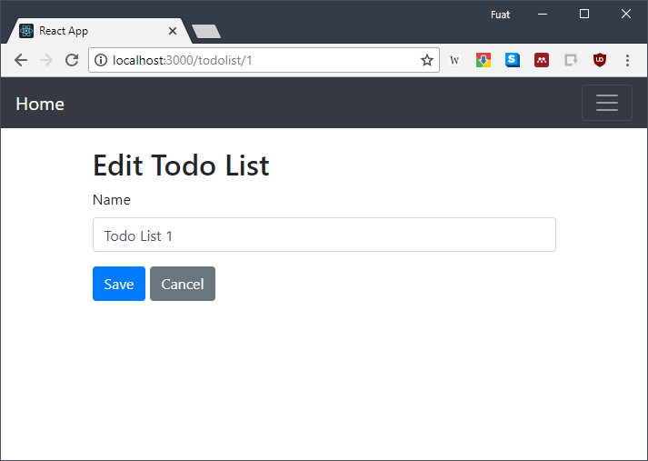

= Spring Boot and React Todo Application

== Requirements to run project
* http://www.oracle.com/technetwork/java/javase/downloads/jdk8-downloads-2133151.html[Java 8]
* Any Java IDE(https://www.jetbrains.com/idea/download[IntelliJ IDEA] is recommended)

* https://nodejs.org/en/[Node.js 8]
* https://yarnpkg.com/en/[Yarn]

== How to run project
* Import project using your favorite java ide.
* Build project
* To start backend server, open your ide's terminal and put: 
[source,]
----
mvnw spring-boot:run
----

* To start frontend, open Node.js command prompt(for windows) or terminal(for linux and osx) and go to app directory. For example:
[source,]
----
cd C:\Users\Fuat\IdeaProjects\spring-react-todo\app
----
* Install dependencies using following command:
[source,]
----
yarn install
----
* Start frontend using following command:
[source,]
----
yarn start
----
* You can access the application with:
[source,]
----
http://localhost:3000/
----

== Whats done
* Create to-do lists. Each to-do list will have a name.
* List of to-do lists.
* Delete to-do list
* Add to-do item to existing to-do list__(backend implementation only)__
* Add dependency between to-do items__(backend implementation only)__
* Each to-do item should have a name, description, deadline, and status__(backend implementation only)__
* Mark to-do item as "Complete"__(backend implementation only)__

== Screenshots

